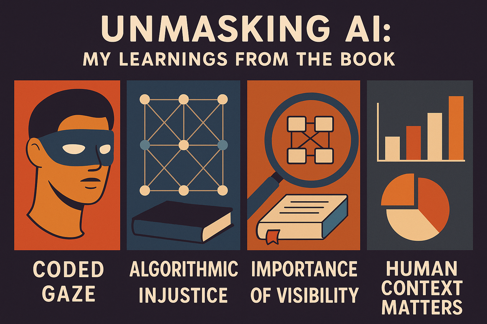
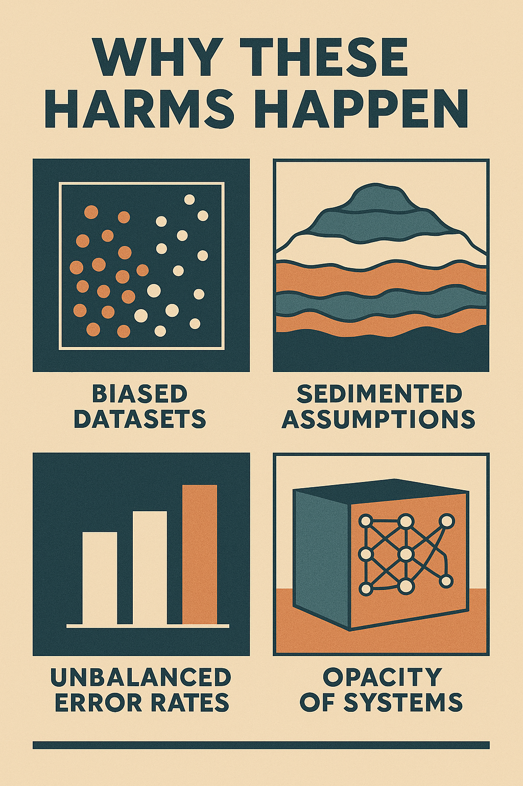
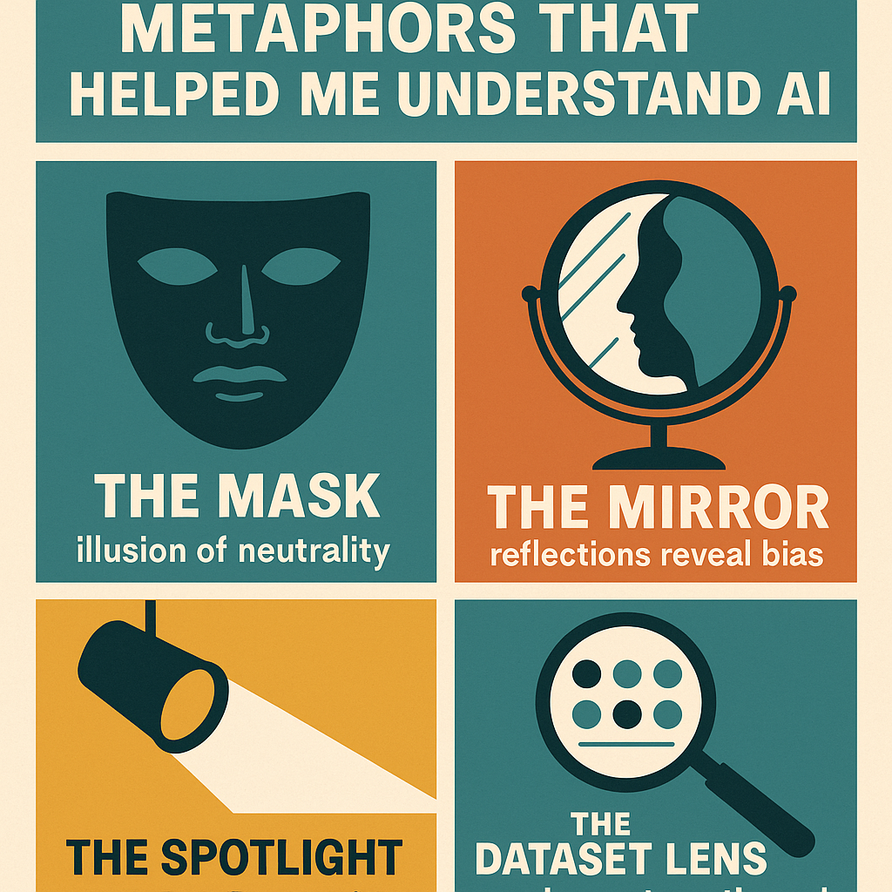
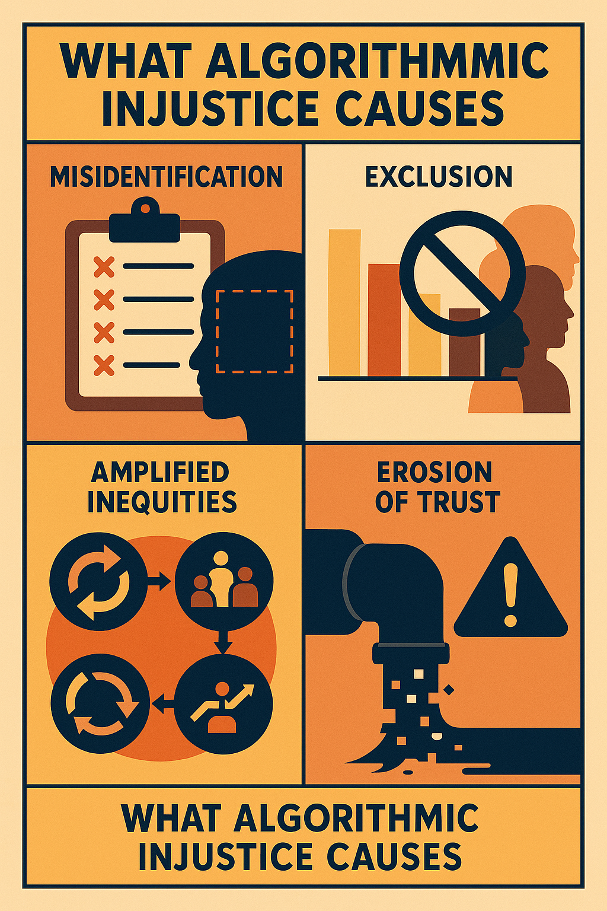

# Book-Club-Reflection

## 🧾 Attribution (Use of AI Citation)  

> AI has not been used for this assignment, only editing and graphics tools like canva have been used to design/edit visuals.  

## Unmasking AI 

### Creative Reflection and Learnings.

**Comic Book style infographics**

**Description**:

Reading Unmasking AI shifted the way I see algorithmic systems. Joy Buolamwini’s idea of the coded gaze, how some faces are recognized and others overlooked became the anchor for my visual reflection. Turning her insights into panels helped me process how bias enters AI through the data we collect, the assumptions we inherit, and the opacity we often take for granted.

The metaphors Joy uses: the mask, the mirror, the spotlight made the technical feel human, and I leaned on those images in my design. They helped me understand that AI doesn’t just produce outputs; it reflects choices, omissions, and power. 

Visualizing the consequences she describes misidentification, exclusion, amplified inequities made those impacts feel real rather than abstract.

My final page captures the commitments I’m taking from the book: to question defaults, audit systems critically, demand explanations, and keep human context at the center. 

Creating this comic-infographic didn’t just summarize the book for me; it helped me internalize its message and imagine how I want to build and evaluate AI moving forward.

